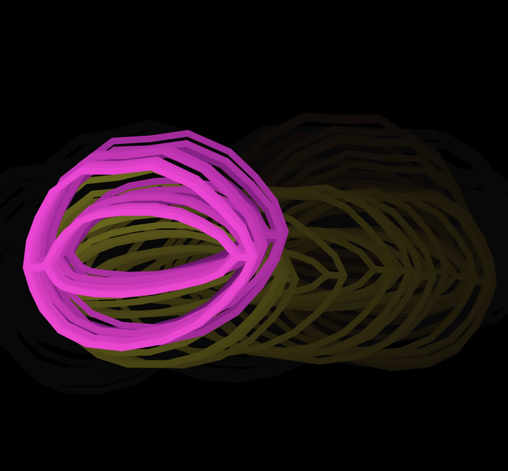
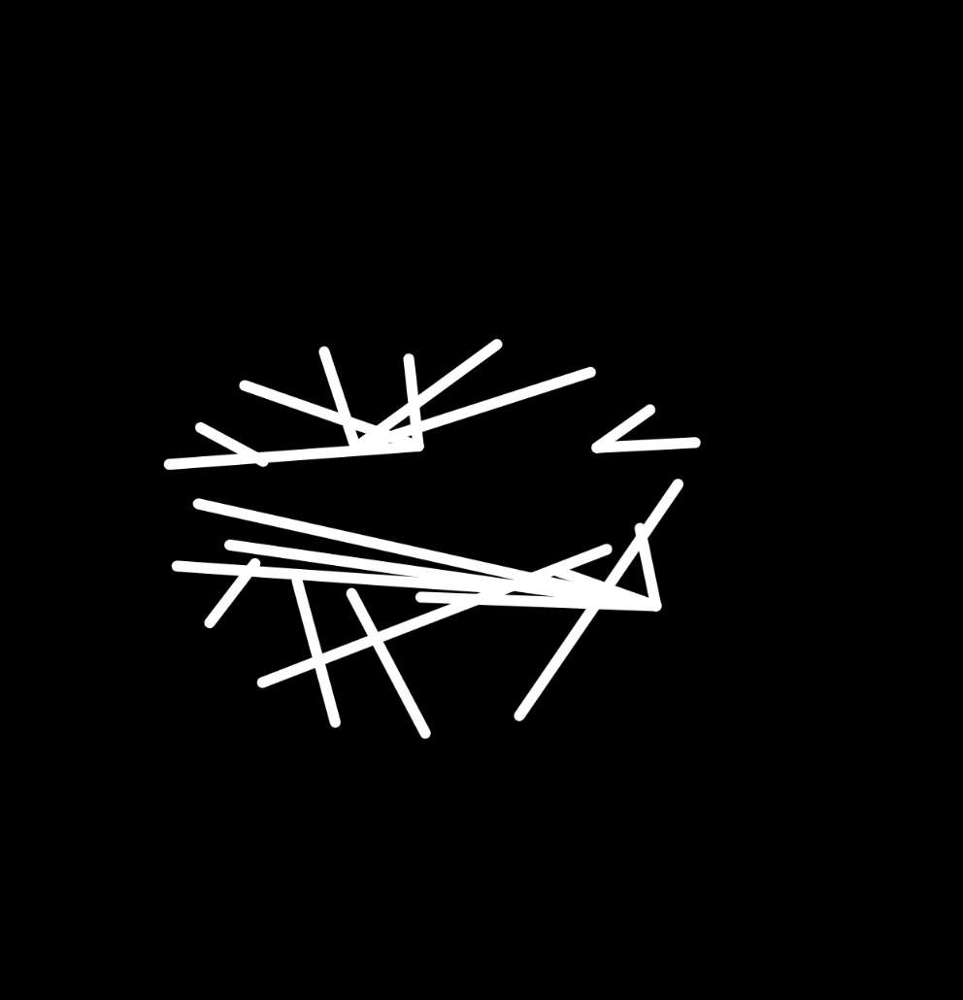
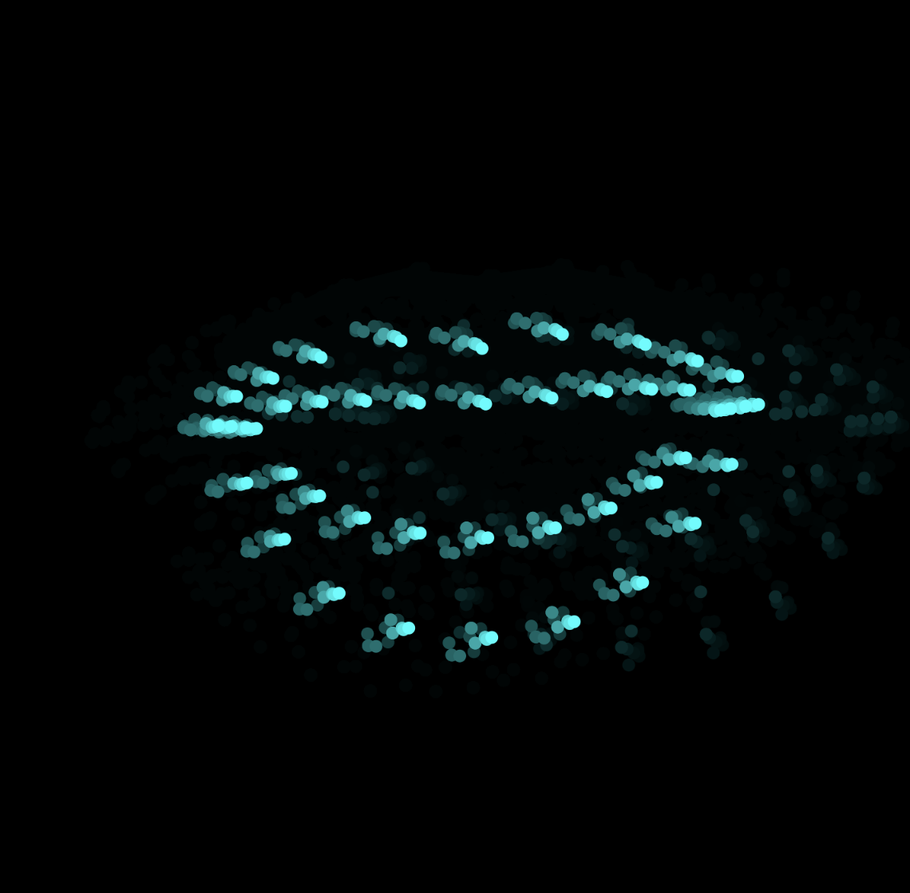

# 2022_Paseo

What is this and how does it work???

This was an art project for the 2022 Paseo festival! This code has 2 p5.js sketches that run together. The code is relatively stable and clean, but defintely not perfect. https://paseoproject.org/paseo2022 

## Description of sketches
### Sketch 1: record.js
* This sketch uses mediapipe in p5.js to detect a mouth and its landmarks. 
* Once this is loaded, the code determines an animation state and draws an effect using the landmarks. There are 8 animations possible. All labeled drawAnimationX where X is the identifying number of the animation
* The recording is triggered by the key press of the number '2' -- but this can be changed. '2' triggered a state change to either proceed forward in directions (state 1-->2), proceed to record (state 2-->3), stop recording and reset (state 3 -->4)
* It utilizes the server library for p5.js to tell the loop.js sketch that a new video and audio are being recorded AND when they are downloaded
* However, loop.js does not need to be run to make record.js work 
* Files are saved as a .wav file and .webm file in the Downloads directory of the local computer. 
* This script actually saves two files per recording session -- the odd numbers are the actual content and the only ones sent.

### Sketch 2: loop.js 
* This sketch loads in a desired amount of files in SETUP and plays them in a loop by randomly selecting a video 
* New videos and audios are loaded in via an async promise when the sketch recieves a keyword from the record.js sketch 
* The loop goes indefintely, just selecting random video/audio pairs from the arrays
* This code only loads in odd numbers for these files and increments its max index of the files accordingly

### Sketch 3 (DO NOT EDIT): landmarks.js 
* This code simply helps with the face landmarks. It does not effect the art piece but will break if editted. 

## How to run
1. Download repo 
2. Make sure you are connected to the internet 
3. Start up a local server
4. Navigate to /face_vid_audio/index.html to record. This sketch must be run FIRST. Once this is loaded completely you can run loop.js 
5. loop.js will want some data, so make that match with the preload directy and expectation of the number of files. 

## Issues? 
Please find me at twitter @ninasketches 

## Here's some of the filters

